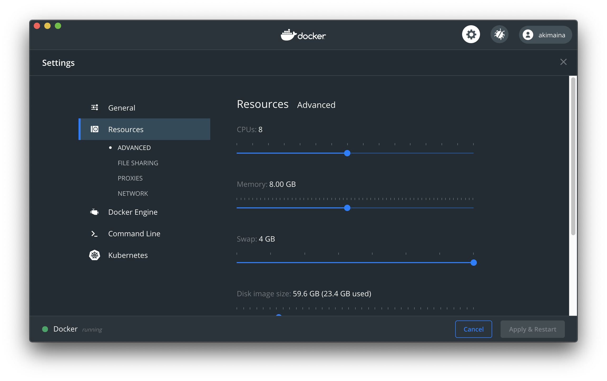
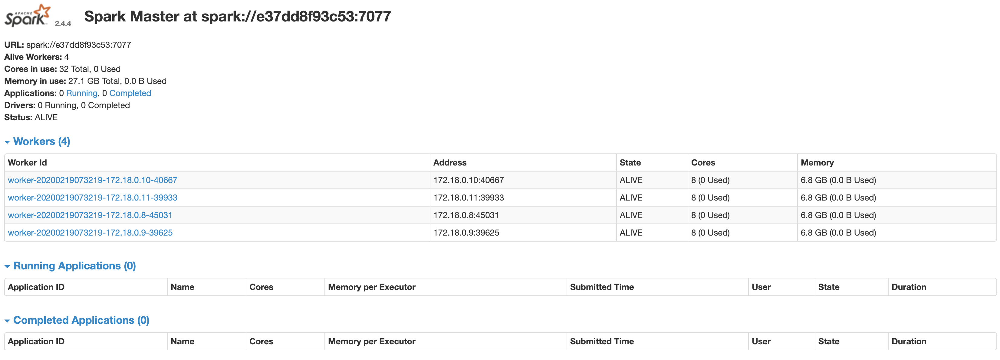
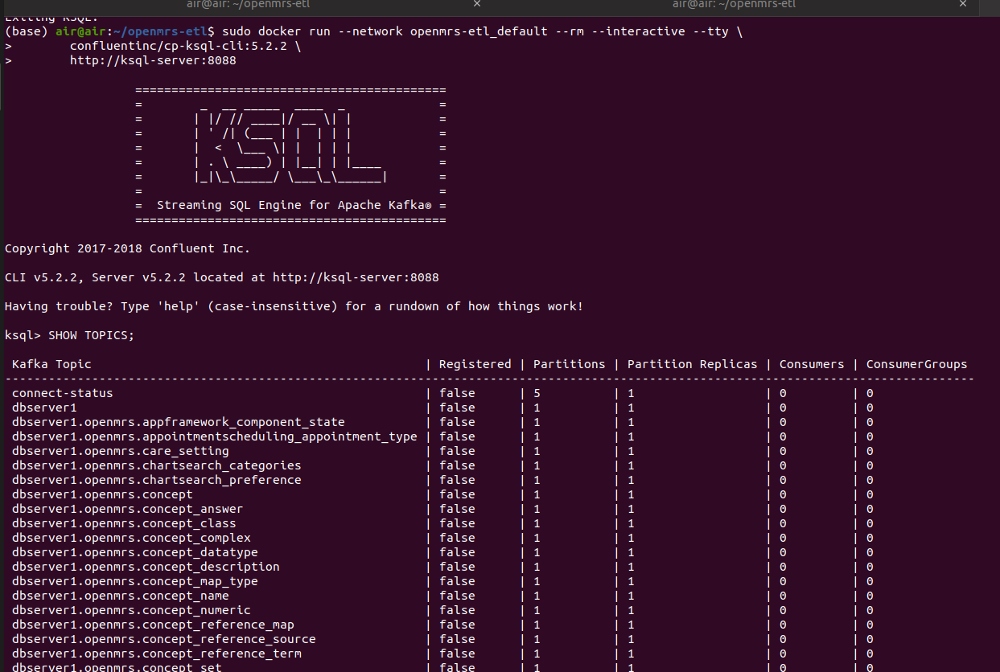

# Openmrs Real-time Streaming Topology


- The motivation of this project is to provide ability of processing data in **real-time**
 from various sources like openmrs, eid, e.t.c
 

## Requirements
Make sure you have the latest docker and docker compose
1. Install [Docker](http://docker.io).
2. Install [Docker-compose](http://docs.docker.com/compose/install/).
3. Clone this repository

# Getting started 
You will only have to run only 3 commands to get the entire cluster running. Open up your terminal and run these commands:

```shell
# this will install  5 containers (mysql, kafka, connect (dbz), openmrs, zookeeper, portainer and cAdvisor)
# cd /media/sf_akimaina/openmrs-etl
export DEBEZIUM_VERSION=0.8
docker-compose -f docker-compose.yaml up

# Start MySQL connector (VERY IMPORTANT)
curl -i -X POST -H "Accept:application/json" -H  "Content-Type:application/json" http://localhost:8083/connectors/ -d @register-mysql.json


# Realtime streaming and processing
Please use either spark(scala)/pyspark/ksql. For this project I'll demo using ksql

```
In order to avoid crashing of containers i.e code 137, please increase memory size and cpu of your docker VM to > 8gb and >4 cores as shown in the figure below




If everything runs as expected, expect to see all these containers running:


You can access this here: http://localhost:9000


## Openmrs
Openmrs Application will be eventually accessible on http://localhost:8080/openmrs.
Credentials on shipped demo data:
  - Username: admin
  - Password: Admin123
  
## Spark Master and Worker Nodes




* Master Node: http://localhost:4040/
* Worker Node 1: http://localhost:8100/
* Worker Node 2: http://localhost:8200/
* Worker Node 3: http://localhost:8300/
* Worker Node 4: http://localhost:8400/

Besed on: https://github.com/big-data-europe/docker-spark/blob/master/README.md

for spark on kubernetes deployment: https://github.com/big-data-europe/docker-spark/blob/master/README.md

## Docker Container Manager: Portainer
http://localhost:9000


  
# MySQL client

    docker-compose -f docker-compose.yaml exec mysql bash -c 'mysql -u $MYSQL_USER -p$MYSQL_PASSWORD inventory'
    

## Schema Changes Topic
 
    docker-compose -f docker-compose.yaml exec kafka /kafka/bin/kafka-console-consumer.sh     --bootstrap-server kafka:9092     --from-beginning     --property print.key=true     --topic schema-changes.openmrs

## How to Verify MySQL connector (Debezium)
 
    curl -H "Accept:application/json" localhost:8083/connectors/

## Shut down the cluster
    
    docker-compose -f docker-compose.yaml down


## Debezium Topics

 
 #### Consume messages from a Debezium topic [obs,encounter,person, e.t.c]
 - All you have to do is change the topic to  --topic dbserver1.openmrs.<tableName>
 
 ```shell
    docker-compose -f docker-compose.yaml exec kafka /kafka/bin/kafka-console-consumer.sh \
     --bootstrap-server kafka:9092 \
     --from-beginning \
     --property print.key=true \
     --topic dbserver1.openmrs.obs
 ``` 
 
## Consume messages using KSQL

 
 #### Start KSQL CLI
 
 ```shell
   docker run --network openmrs-etl_default --rm --interactive --tty \
       confluentinc/cp-ksql-cli:5.2.2 \
       http://ksql-server:8088

 ``` 
 After running the above command, a KSQL CLI will be presented interactively
 
 #### Run KSQL Streaming SQL 
 You can call any KSQL streaming sql command as highlighted here 
 https://docs.confluent.io/current/ksql/docs/tutorials/index.html
 Here are a few examples:
 
 ```shell
   SHOW TOPICS;

 ``` 
 
 
 
 For more KSQL streaming command please visit  https://docs.confluent.io/current/ksql
## Cluster Design Architecture
- This section attempts to explain how the clusters work by breaking everything down
- Everything here has been dockerized so you don't need to do these steps
    
    * Kafka Cluster: [Kafka](kafka.md)
    * Spark Cluster: [Spark](spark.md)
    * Debezium Layer: [Debezium](debezium.md)

## Directory Structure
```
project
│   README.md 
│   kafka.md  
│   debezium.md
│   spark.md
│   docker-compose.yaml
│   
│
template
│   │   java
│   │   python
│   │   scala
│   └───subfolder1
│       │   file111.txt
│       │   file112.txt
│       │   ...

```

## Writing batch/streaming jobs

* Java Template: [Java](template/java/README.md)
* Python Template: [Python](template/python/README.md)
* Scala Template: [Scala](template/scala/README.md)

Besed on: https://github.com/big-data-europe/docker-spark/blob/master/README.md
